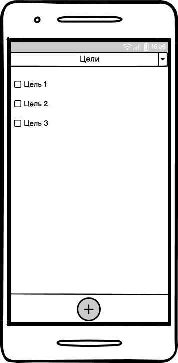
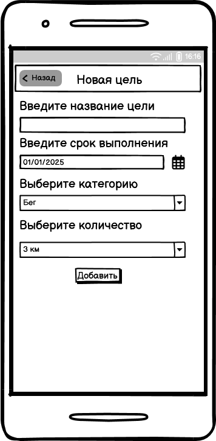
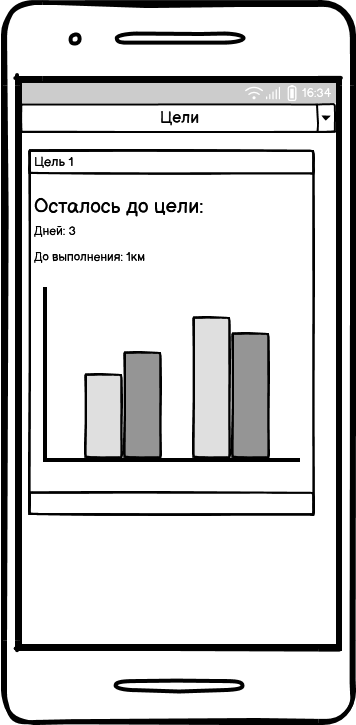
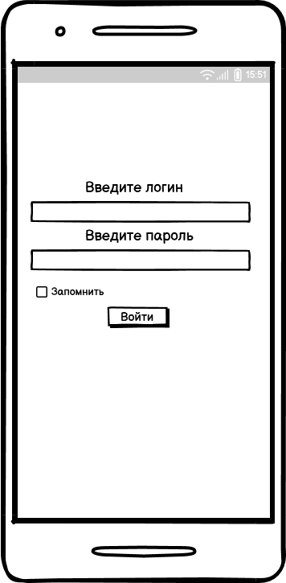

# Требования к проекту

---

# Содержание
1 [Введение](#intro)     
2 [Требования пользователя](#user_requirements)  
2.1 [Программные интерфейсы](#software_interfaces)  
2.2 [Интерфейс пользователя](#user_interface)  
2.3 [Характеристики пользователей](#user_specifications)   
2.4 [Предположения и зависимости](#assumptions_and_dependencies)  
3 [Системные требования](#system_requirements)  
3.1 [Функциональные требования](#functional_requirements)   
3.2 [Нефункциональные требования](#non-functional_requirements)  
3.2.1 [Атрибуты качества](#quality_attributes)    

<a name="intro"/>

# 1 Введение

Приложение «Геймификация здоровья» использует игровые элементы для мотивации пользователей к здоровому образу жизни. Оно включает в себя функции отслеживания физической активности, здорового питания, сна и других аспектов здоровья. Пользователи могут зарабатывать достижения за достижение здоровых целей. Приложение помогает повысить мотивацию и улучшить здоровье через игровой подход. 

<a name="user_requirements"/>

# 2 Требования пользователя

<a name="software_interfaces"/>

## 2.1 Программные интерфейсы

Нет внешних систем или библиотек, взаимодействие происходит локально.
Для выбора даты будет использоваться локальный компонент календаря, что позволит пользователям легко и удобно устанавливать даты для задач.

<a name="user_interface"/>

## 2.2 Интерфейс пользователя

Интерфейс включает:
- Главный экран со списком целей.
- Кнопку добавления новой цели.
- Выпадающий список для выбора категории.
- Окно дляя просмотра прогресса текущей цели.
- Окно авторизации.

 

 

 

 
                                  

<a name="user_specifications"/>

## 2.3 Характеристики пользователей

Приложение разрабатывается для любых пользователей.

<a name="application_audience"/>

## 2.4 Предположения и зависимости
- Приложение работает на локальных устройствах без необходимости подключения к интернету.
- Поддержка актуальных операционных систем и экранов.

<a name="system_requirements"/>

# 3 Системные требования

<a name="functional_requirements"/>

## 3.1 Функциональные требования

- Возможность добавления новой цели.
- Возможность фильтрации целей по категориям.
- Возможность просмотра прогресса по целям.
- Возможность редактирования описания целей и установки уведомлений.
- Адаптация интерфейса для мобильных устройств.

<a name="main_functions"/>

## 3.2 Нефункциональные требования

<a name="quality_attributes"/>

### 3.2.1 Атрибуты качества
- **Надежность:** приложение должно работать без сбоев. Измеряется количеством ошибок.
- **Безопасность:** защита данных пользователей. Измеряется количеством инцидентов.
- **Удобство использования:** интуитивный интерфейс. Измеряется через опросы пользователей.
